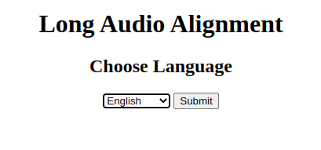
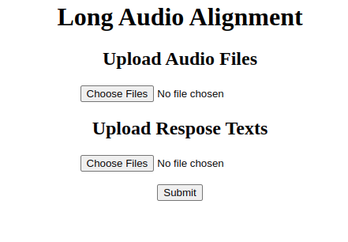
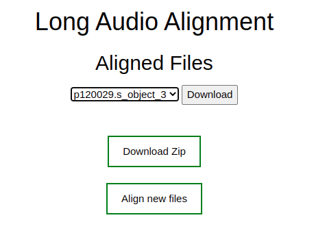

# SailAlign with UI
This is a simple user interface for SailAlign a tool for long audio alignment. 
## How to install 
1. Download HTK binaries from SharePoint:
    * Via [rclone](https://sway.office.com/HLs10wLU3hyJ8jSC?ref=Link "rclone"): 
        	
        ~~~~
        rclone copy -P IMS-Sharepoint:AutomaticSpeechRecognition/htk/HTK-3.4.1.tar.gz .
        rclone copy -P IMS-Sharepoint:AutomaticSpeechRecognition/htk/HTK-3.4.1.tar.gz .
        ~~~~
    * Download them from [here](https://imisathena.sharepoint.com/sites/speech-music-signal-dialogue/Shared%20Documents/Forms/AllItems.aspx?RootFolder=%2Fsites%2Fspeech%2Dmusic%2Dsignal%2Ddialogue%2FShared%20Documents%2FAutomaticSpeechRecognition%2Fhtk&FolderCTID=0x012000D97E6C1BD109AA469F829E267D3D5A55 "rclone").

2. Build dokcer image and run container:

    ~~~~
    docker build -t sail_align .
    docker run -d -p 5000:5000 sail_align
    ~~~~
3. Go to http://localhost:5000/ 
    * Select language:
    
    * Upload audio and text file for alignment:
    
    * Download the alignments one by one or in a zip:
    
